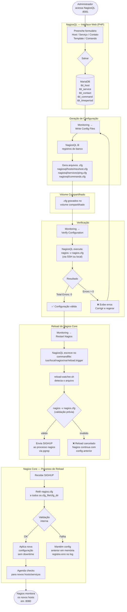
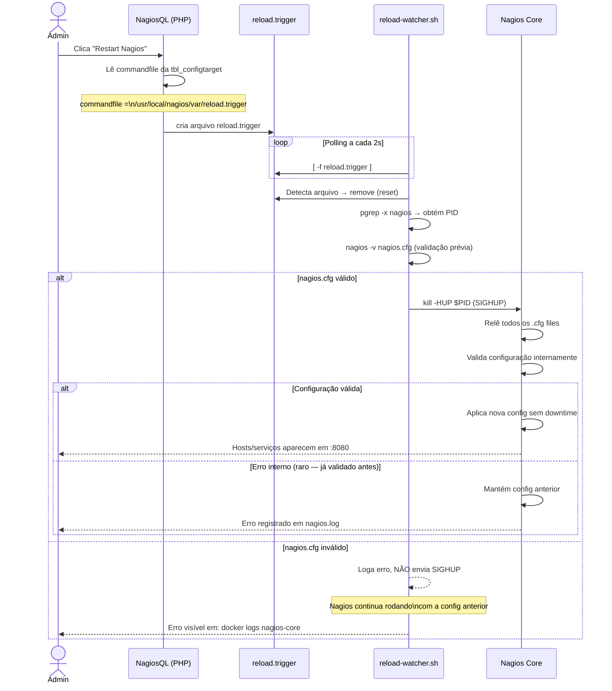
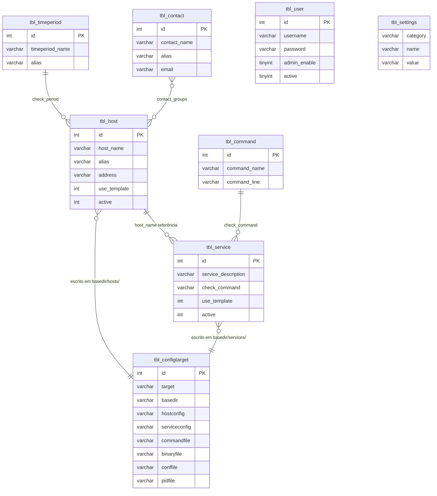

# Diagrama de Funcionamento: NagiosQL + Nagios Core

Este documento descreve o fluxo completo de como uma configuração criada no NagiosQL percorre o sistema até ser efetivamente monitorada pelo Nagios Core.

---

## Visão Geral da Arquitetura

NagiosQL e Nagios Core rodam no **mesmo container** (`nagios-core`), gerenciados pelo supervisord. Essa é a arquitetura natural do NagiosQL: acessa os arquivos `.cfg` e o binário diretamente, sem volumes compartilhados entre containers.

```
┌─────────────────────────────────────────────────────────────────────────┐
│  Host Docker                                                            │
│                                                                         │
│  ┌──────────────────────────────────────────────────────────────────┐  │
│  │   Container: nagios-core                                         │  │
│  │                                                                  │  │
│  │   ┌───────────┐  ┌──────────┐  ┌──────────┐  ┌──────────────┐  │  │
│  │   │   nginx   │  │ php-fpm  │  │ fcgiwrap │  │    nagios    │  │  │
│  │   │:80 → CGIs │  │:8081→PHP │  │  CGIs    │  │  Core daemon │  │  │
│  │   └───────────┘  └──────────┘  └──────────┘  └──────┬───────┘  │  │
│  │                                                      │          │  │
│  │   ┌──────────────────┐     ┌──────────────────────┐  │          │  │
│  │   │  NagiosQL (PHP)  │     │   reload-watcher.sh  │  │          │  │
│  │   │  Lê/Escreve BD   │     │   valida nagios.cfg  │  │          │  │
│  │   │  Gera .cfg files │     │   envia SIGHUP       ├──┘          │  │
│  │   └────────┬─────────┘     └──────────▲───────────┘             │  │
│  │            │                          │                         │  │
│  │   ┌────────▼──────────────────────────┴──────────────────────┐  │  │
│  │   │  ./volumes/nagios-etc/ (bind mount)                      │  │  │
│  │   │  nagiosql/hosts/*.cfg   ◄── NagiosQL escreve             │  │  │
│  │   │  nagiosql/services/*.cfg                                  │  │  │
│  │   │  objects/*.cfg          ◄── Nagios Core lê               │  │  │
│  │   │  nagios.cfg                                               │  │  │
│  │   │  var/reload.trigger     ◄── sinal de reload              │  │  │
│  │   └──────────────────────────────────────────────────────────┘  │  │
│  │                                                                  │  │
│  │   :8080 (Nagios Core)  ──────────────────────────────────────── │  │
│  │   :8081 (NagiosQL)     ──────────────────────────────────────── │  │
│  └──────────────────────────────────────────────────────────────────┘  │
│                                                                         │
│  ┌──────────────────────────────────────────┐                         │
│  │   Container: nagios-db (MariaDB 10.11)   │                         │
│  │   ./volumes/db-data/                     │                         │
│  │   tbl_host, tbl_service, tbl_contact     │                         │
│  └──────────────────────────────────────────┘                         │
└─────────────────────────────────────────────────────────────────────────┘
```

---

## Fluxo Completo: Do Formulário ao Monitoramento



---

## Detalhamento: Geração dos Arquivos .cfg

```mermaid
flowchart LR
    subgraph DB["MariaDB — Tabelas"]
        T1[(tbl_host)]
        T2[(tbl_service)]
        T3[(tbl_contact)]
        T4[(tbl_command)]
        T5[(tbl_timeperiod)]
        T6[(tbl_configtarget)]
    end

    subgraph PHP["NagiosQL — Write Config Files"]
        P1[Lê tbl_configtarget\npara saber os caminhos]
        P2[Gera define host\n{ ... }]
        P3[Gera define service\n{ ... }]
        P4[Gera define contact\n{ ... }]
    end

    subgraph FILES["Volume: nagios-etc/nagiosql/"]
        F1[hosts/meuhost.cfg]
        F2[hosts/servidor-web.cfg]
        F3[services/ping.cfg]
        F4[services/http.cfg]
        F5[contacts.cfg]
        F6[commands.cfg]
        F7[hosttemplates.cfg]
        F8[servicetemplates.cfg]
    end

    T6 --> P1
    T1 --> P2 --> F1 & F2
    T2 --> P3 --> F3 & F4
    T3 --> P4 --> F5
    T4 --> F6
    T5 --> F7 & F8
```

---

## Detalhamento: Mecanismo de Reload



---

## Estrutura de Arquivos no Volume Compartilhado

```
./volumes/nagios-etc/
│
├── nagios.cfg                      ← Arquivo principal (lido pelo Nagios Core)
│   │  cfg_file=.../timeperiods.cfg     │
│   │  cfg_dir=.../nagiosql/hosts/      │── NagiosQL inclui esses paths
│   │  cfg_dir=.../nagiosql/services/   │
│   └─ ...                              │
│
├── objects/                        ← Defaults do Nagios Core (não editados pelo NagiosQL)
│   ├── commands.cfg                    Comandos padrão (check_ping, check_http, etc.)
│   ├── contacts.cfg                    Contato nagiosadmin
│   ├── templates.cfg                   Templates linux-server, generic-service
│   ├── timeperiods.cfg                 24x7, workhours
│   └── localhost.cfg                   Host padrão localhost
│
├── nagiosql/                       ← Gerenciado exclusivamente pelo NagiosQL
│   ├── commands.cfg                    Comandos customizados (ex: check_dns)
│   ├── contacts.cfg                    Contatos criados via NagiosQL
│   ├── hosttemplates.cfg               Templates de host
│   ├── servicetemplates.cfg            Templates de serviço
│   ├── timeperiods.cfg                 Períodos customizados
│   ├── hostgroups.cfg                  Grupos de hosts
│   ├── servicegroups.cfg               Grupos de serviços
│   ├── hosts/                      ← Um .cfg por host
│   │   ├── gateway.cfg
│   │   ├── google-dns.cfg
│   │   └── linux-host.cfg
│   ├── services/                   ← .cfg agrupados por tipo de serviço
│   │   ├── ping.cfg
│   │   ├── http.cfg
│   │   └── ssh.cfg
│   └── backup/                     ← NagiosQL guarda versões anteriores aqui
│       ├── hosts/
│       └── services/
│
└── var/
    ├── reload.trigger              ← NagiosQL escreve aqui para disparar reload
    ├── nagios.log                  ← Log principal do Nagios
    ├── status.dat                  ← Estado atual de todos os hosts/serviços
    ├── rw/
    │   ├── nagios.cmd              ← Pipe de comandos externos (grupo nagioscfg)
    │   └── nagios.qh               ← Query handler socket
    └── spool/checkresults/         ← Resultados dos checks ativos
```

---

## Tabelas do Banco de Dados (MariaDB)



---

## Resumo do Ciclo Completo

| Etapa | Responsável | O que acontece |
|---|---|---|
| **1. Cadastro** | NagiosQL (usuário) | Dados inseridos via formulário → salvos no MariaDB |
| **2. Geração** | NagiosQL (PHP) | Lê o banco → gera arquivos `.cfg` no volume |
| **3. Verificação** | NagiosQL → Nagios | Executa `nagios -v nagios.cfg` → exibe erros/warnings |
| **4. Sinalização** | NagiosQL | Cria `reload.trigger` para disparar o reload |
| **5. Validação prévia** | reload-watcher.sh | Detecta o trigger → executa `nagios -v` antes de recarregar |
| **6. SIGHUP** | reload-watcher.sh | Só enviado se a validação passar — protege config anterior |
| **7. Reload** | Nagios Core | Relê todos os `.cfg` → valida → aplica sem downtime |
| **8. Monitoramento** | Nagios Core | Agenda e executa checks dos novos hosts/serviços |
