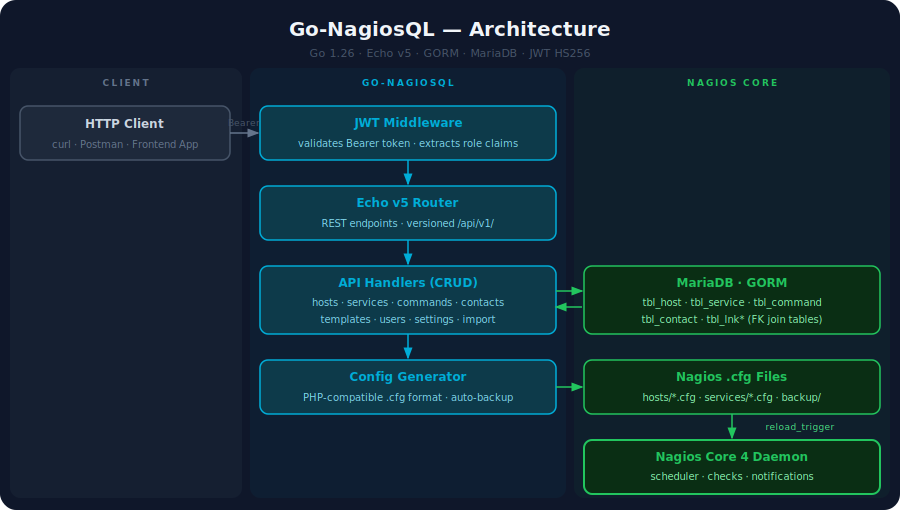
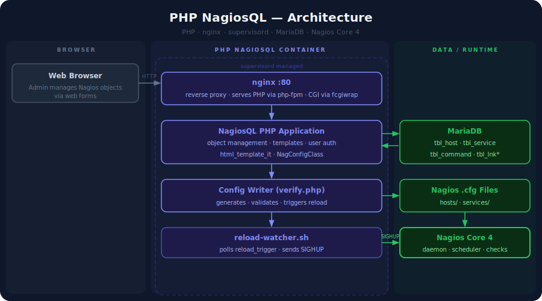
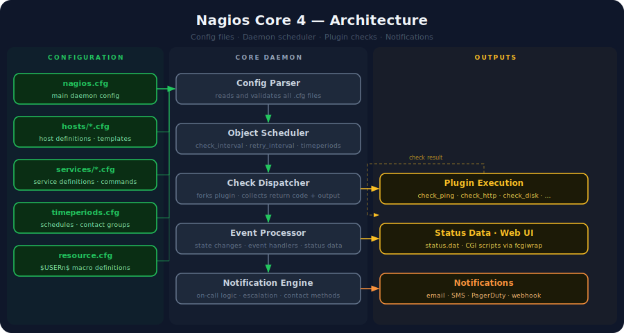

# Go-NagiosQL

A Go rewrite of [NagiosQL](https://www.nagiosql.org/) — a web-based configuration manager for Nagios/Icinga.

**Stack:** Go 1.26 · Echo v5 · GORM · Cobra · Viper · MariaDB · JWT

---

## Architecture

### Go-NagiosQL



### PHP NagiosQL (reference)



### Nagios Core 4



---

## Quick Start

```bash
# 1. Configure
cp config.toml.example config.toml
# Edit config.toml — change jwt.secret and database credentials

# 2. Migrate database
go run . migrate --admin-password yourpassword --sample

# 3. Run
make build
./bin/nagiosql serve
```

API is available at `http://localhost:8081`.
Swagger UI at `http://localhost:8081/docs/swagger-ui.html`.

---

## CLI

```
nagiosql serve              Start the HTTP API server
nagiosql migrate            AutoMigrate schema; seed admin user
nagiosql import             Import Nagios .cfg files into the database
nagiosql config write       Write current config to stdout
nagiosql config verify      Run nagios -v nagios.cfg
nagiosql config restart     Touch reload_trigger to signal reload
nagiosql version            Print version and build date
```

---

## Development

```bash
make build             # compile → bin/nagiosql
make test              # unit tests (SQLite in-memory, no external deps)
make db-start          # start MariaDB 10.11 on :3307 via Docker
make test-integration  # integration tests against the test DB
make check             # vet + build + test  (CI entry point)
make swagger           # regenerate OpenAPI docs
```

---

## Documentation

Detailed reference lives in [`DOCUMENTS/`](DOCUMENTS/README.md):

| Document | Description |
|----------|-------------|
| [Configuration reference](DOCUMENTS/README.md#configuration) | All `config.toml` keys and environment variables |
| [API reference](DOCUMENTS/README.md#api-reference) | Every endpoint with request/response examples |
| [Migrating from PHP NagiosQL](DOCUMENTS/README.md#migrating-from-php-nagiosql) | Schema compatibility, legacy passwords, cutover steps |
| [Docker deployment](DOCUMENTS/README.md#docker) | Production image and full Nagios stack compose |
| [Security notes](DOCUMENTS/README.md#security-notes) | Passwords, JWT, reload trigger |
| [Architecture — PHP NagiosQL](DOCUMENTS/docs/DIAGRAMA_NAGIOSQL.md) | Original system diagram and config lifecycle |

---

## License

MIT
